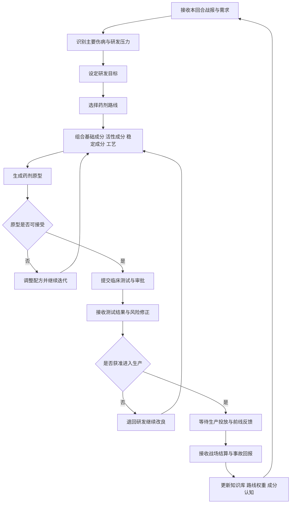
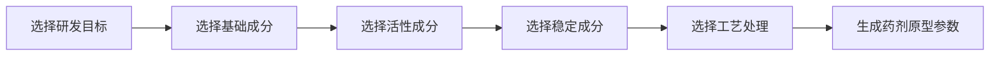
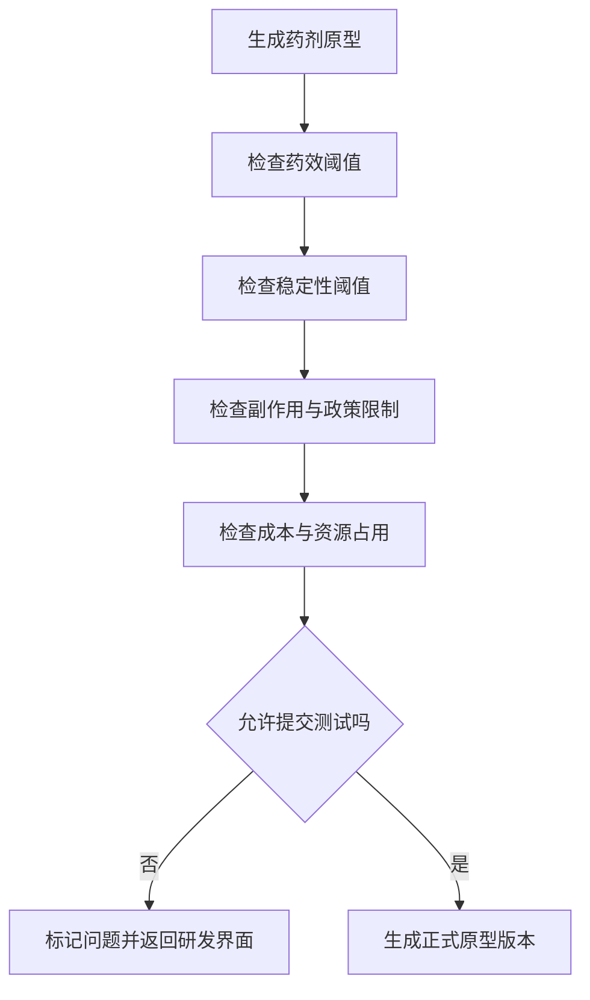
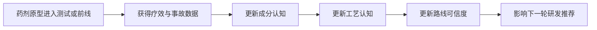
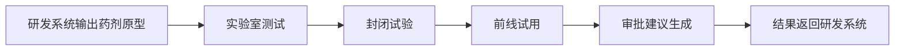
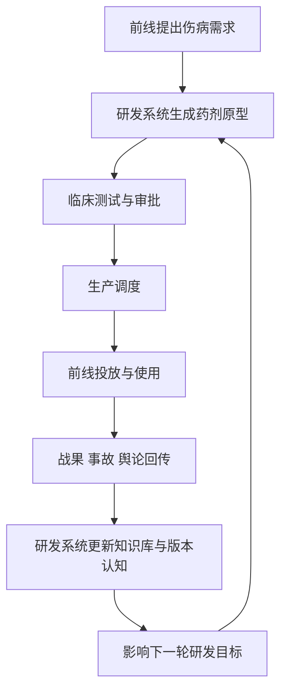
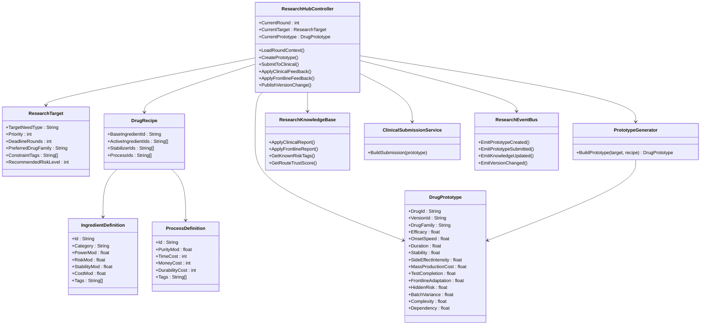
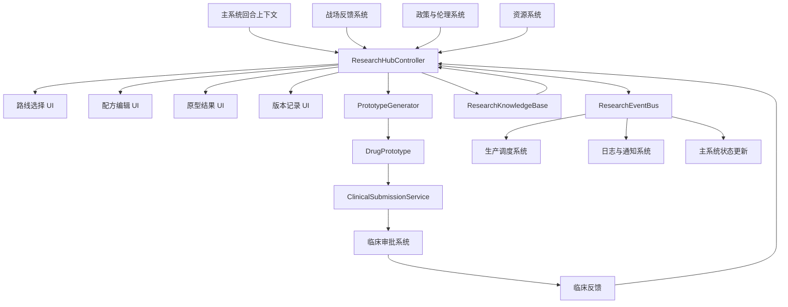

# 药剂研发系统 GDD

## 1. 系统定位

药剂研发系统是《前线药剂局：紧急授权》的核心决策前端，负责将前线伤病需求、资源限制与政策压力转化为可提交测试和审批的药剂原型。

本系统不直接负责临床测试、审批裁决、批量生产与前线结算，但负责为这些模块提供统一的研发入口、药剂数据源与版本迭代中心。

在项目分工上，药剂研发系统承担以下职责：

1. 接收主系统与前线反馈模块传入的本回合需求。
2. 组织玩家进行药剂路线选择、成分组合、工艺处理与版本迭代。
3. 生成可测试的药剂原型数据。
4. 将原型提交给临床审批与测试系统。
5. 接收临床测试与前线回报，更新药剂知识库与下一轮研发方向。
6. 作为药剂相关数据的主控窗口，向临床、生产、战报等系统广播药剂状态变化。

一句话定义：

`药剂研发系统 = 战场问题到药剂原型的转译器 + 药剂版本的总控中心`

## 2. 设计目标

本系统需要同时满足四个目标：

1. 让玩家感受到“研发不是解题，而是带代价的决策”。
2. 让每次药剂研发都天然带有收益与风险的绑定关系。
3. 为临床测试、生产调度、前线反馈提供统一、稳定的数据接口。
4. 在玩法上形成“研发 -> 测试 -> 使用 -> 反馈 -> 再研发”的持续循环。

研发系统的体验重点不是让玩家做复杂化学模拟，而是让玩家在有限时间与有限信息下做出不完美但必要的选择。

## 3. 玩家体验目标

玩家在研发界面中应持续感受到：

1. 自己总能做出一个方案，但很少能做出完美方案。
2. 快速见效通常意味着更大的副作用或更高的隐藏风险。
3. 稳定安全的药剂往往成本更高、开发更慢、量产更难。
4. 同一种前线危机可以通过不同路线解决，但每条路线的代价不同。
5. 每一次点击“提交测试”或“紧急放行”都像在签署责任书。

## 4. 系统边界

### 4.1 本系统负责

1. 需求解析。
2. 药剂路线管理。
3. 配方构建。
4. 药剂原型生成。
5. 药剂版本迭代。
6. 研发资源消耗结算。
7. 药剂知识库与经验回写。
8. 向其他系统输出药剂原型、药剂版本和参数变更通知。

### 4.2 本系统不负责

1. 临床测试过程的具体模拟。
2. 审批是否最终通过。
3. 批量生产排程。
4. 战区运输与投放逻辑。
5. 前线战斗结算。
6. 舆论、政策、社会支持的最终结算。

### 4.3 对外依赖模块

1. 主系统：提供回合推进、章节阶段、资源总表、事件触发。
2. 临床审批与测试系统：接收药剂原型并返回测试结果。
3. 生产与调度系统：接收获批药剂并决定量产与投放。
4. 战场反馈与结算系统：返回药效表现、事故事件、前线反馈。
5. 政策与伦理系统：提供额外权限、限制项与风险修正器。
6. 舆论与社会支持系统：根据药剂事故影响后续研发环境。

## 5. 核心循环

药剂研发系统在每回合中的核心循环如下：



这条循环的关键不是做出“正确药剂”，而是在不断恶化的战局中做出“当前可接受的坏选择”。

## 6. 回合输入与输出

### 6.1 输入数据

每回合进入研发系统时，至少需要接收以下输入：

1. `ChapterStage`
   当前战役阶段，例如基础创伤、燃烧阶段、神经毒剂阶段。
2. `FrontlineDemandProfile`
   当前伤病需求权重，例如失血 40、感染 25、烧伤 20、精神损伤 15。
3. `CommandPressure`
   指挥部需求，例如两回合内必须交付、优先保障某兵种。
4. `ResourceSnapshot`
   当前资金、研究点、原料库存、设备状态、产能上限。
5. `PolicyModifier`
   由政策系统提供的额外权限与风险修正，例如允许跳过部分测试。
6. `RecentIncidentHistory`
   最近几回合的重要药剂事故、舆论事件和失败案例。

### 6.2 输出数据

研发系统每轮可向外输出以下内容：

1. `DrugPrototype`
   当前版本药剂原型，用于提交临床系统。
2. `ResearchReport`
   本轮研发摘要，记录参数变化、风险说明与建议测试层级。
3. `DrugVersionChange`
   药剂版本变更通知，用于同步 UI、日志与其他模块。
4. `KnowledgeUpdate`
   对成分、路线、工艺的经验更新结果。

## 7. 研发目标生成

研发系统首先要把“战报”翻译成“研发任务”。

### 7.1 战报到目标的转化逻辑

例如：

1. 大规模失血激增 -> 提高止血药优先级。
2. 烧伤感染蔓延 -> 提高烧伤凝胶和抗感染药优先级。
3. 夜战存活率骤降 -> 提高镇痛或应激维持药优先级。
4. 神经毒剂扩散 -> 提高神经抑制或防护药优先级。
5. 指挥部要求精锐部队快速返战 -> 提高速效型方案优先级。

### 7.2 研发目标数据结构建议

研发目标至少包含：

- `TargetNeedType`
- `Priority`
- `DeadlineRounds`
- `PreferredDrugFamily`
- `ConstraintTags`
- `RecommendedRiskLevel`

## 8. 药剂路线设计

建议药剂路线按“系列 -> 分支 -> 版本”三级结构设计。

### 8.1 系列层

建议初版包括：

1. `止血系列`
2. `镇痛系列`
3. `抗感染系列`
4. `应激强化系列`
5. `神经/辐射防护系列`

### 8.2 分支层

每个系列可拆为不同用途分支。

以止血系列为例：

1. `廉价量产型`
   适合普通部队和大规模消耗。
2. `前线速效型`
   优先处理急救时效，但副作用偏高。
3. `高危重伤急救型`
   适合精锐和极端战况，成本高、风险高。

### 8.3 版本层

每种分支下允许药剂持续迭代，例如：

- `止血剂 Mk1`
- `止血剂 Mk2`
- `止血剂 Mk2A`
- `止血剂 Mk3 实验型`

版本存在的意义：

1. 体现药剂不是一次性成品，而是不断修正的实验结果。
2. 为临床与前线反馈提供可追踪对象。
3. 支持未来的事故追责、战后清算和知识积累。

## 9. 配方构建模块

配方构建是玩家的核心操作区。每个药剂由四类组件构成：

1. `基础成分`
   决定药剂的基础用途和方向。
2. `活性成分`
   决定药效强度、起效速度和风险上限。
3. `稳定成分`
   决定稳定性、保存性、副作用抑制能力。
4. `工艺处理`
   决定提纯、浓缩、过滤、蒸馏等加工结果。

流程图如下：



### 9.1 基础成分设计职责

基础成分主要决定：

1. 药剂属于哪条路线。
2. 基础治疗方向是什么。
3. 是否具备最低可用性。

### 9.2 活性成分设计职责

活性成分主要决定：

1. 治疗效率。
2. 生效速度。
3. 副作用上限。
4. 隐藏风险上限。

设计原则：

`高效成分通常不安全，低风险成分通常不够强。`

### 9.3 稳定成分设计职责

稳定成分主要决定：

1. 稳定性。
2. 保存时间。
3. 副作用缓冲。
4. 前线适配性。

### 9.4 工艺处理设计职责

工艺主要决定：

1. 成分纯度。
2. 杂质比例。
3. 成本消耗。
4. 研发时间。
5. 设备损耗。

可选工艺例如：

1. 离心
2. 蒸馏
3. 过滤
4. 浓缩
5. 冷萃
6. 粗制急配

工艺的设计价值在于让玩家可以通过“加工方式”而不是“换材料”来修正配方结果。

## 10. 药剂原型生成

配方组合完成后，系统生成一个 `DrugPrototype`。

原型表示“理论上可以进入测试和审批的版本”，并不是最终成药。

### 10.1 药剂核心参数

建议药剂原型至少包含以下 8 个显性参数：

1. `治疗效率`
2. `生效速度`
3. `持续时间`
4. `稳定性`
5. `副作用强度`
6. `量产成本`
7. `测试完成度`
8. `前线适配性`

### 10.2 隐性参数

建议再加入以下 4 个系统级参数：

1. `隐藏风险值`
   用于决定临床与前线事故爆发概率。
2. `批次波动`
   用于决定量产后不同批次的品质差异。
3. `研发复杂度`
   用于决定继续改良时的成本与难度。
4. `原料依赖度`
   用于决定该药是否容易被稀缺资源卡死。

### 10.3 参数关系原则

参数之间应形成天然冲突：

1. 生效越快，副作用通常越大。
2. 治疗效率越高，隐藏风险通常越高。
3. 稳定性越高，成本和开发时间通常越高。
4. 量产成本越低，批次波动通常越大。
5. 紧急成药越快，测试完成度通常越低。

### 10.4 初版建议公式逻辑

可以使用如下简化关系：

```text
EffectivePower = 治疗效率 * 前线适配性 * (0.7 + 0.3 * 测试完成度)
SideEffectRate = 副作用强度 * (1.2 - 稳定性系数) * (1.1 - 测试完成度系数)
IncidentProb = 隐藏风险值 * (1.3 - 测试完成度系数) * 量产强度系数
ResearchCost = 原料成本 + 工艺成本 + 复杂度修正 + 设备损耗
```

初版无需追求绝对真实，只要保证参数之间存在有趣的权衡即可。

## 11. 原型可提交判定

生成原型后，系统需要先做一次内部校验，判定其是否能进入测试。

### 11.1 可提交条件建议

至少满足以下条件之一：

1. 核心药效达到最低阈值。
2. 稳定性不低于最低阈值。
3. 副作用不超过当前政策允许上限。
4. 研发资源消耗在可承担范围内。
5. 未触发明确禁配组合。

### 11.2 判定流程图



如果不满足条件，玩家可以继续改配方，而不是直接判定研发失败。

## 12. 版本迭代系统

研发系统的关键不是一次造药成功，而是不断迭代。

### 12.1 迭代来源

药剂版本的迭代通常来自：

1. 玩家主动追求更强疗效。
2. 临床测试暴露副作用问题。
3. 前线反馈显示药剂不适合当前环境。
4. 原料供应变化迫使替换成分。
5. 新战场阶段出现新的伤病需求。

### 12.2 迭代动作

玩家可执行的常见迭代行为：

1. 替换活性成分。
2. 增减稳定剂。
3. 切换工艺路线。
4. 压低副作用，牺牲部分药效。
5. 压低成本，接受批次波动上升。
6. 提高生效速度，接受隐藏风险升高。

### 12.3 版本意义

版本迭代不仅用于成长，还用于叙事与责任追踪。

例如：

- 某个事故来自 `镇痛剂 Mk2B`。
- 某次重大救援依赖 `止血剂 Mk3 前线速效型`。
- 某种禁用成分是在 `应激剂 Mk1` 中首次暴露风险。

## 13. 知识库与研发经验

研发系统需要维护一套药剂知识库，用于记录“我们已经知道什么”。

### 13.1 知识库记录内容

1. 成分已知效果。
2. 成分与成分之间的相容性。
3. 特定工艺对特定成分的加成或惩罚。
4. 在不同战区中的表现差异。
5. 已确认的副作用和事故历史。
6. 尚未完全确认的可疑风险。

### 13.2 知识库作用

1. 为玩家提供逐步揭示的信息反馈。
2. 限制玩家在前期就完全掌握所有结果。
3. 让临床与前线反馈具有长期价值。
4. 支持“经验式推荐”和“事故预警”。

### 13.3 经验反馈机制



## 14. 与临床审批系统的接口

研发系统与临床系统的关系是“提交原型 -> 获取验证结果 -> 决定继续迭代或放行”。

### 14.1 研发系统向临床系统输出

建议最小字段如下：

- `DrugId`
- `VersionId`
- `DrugFamily`
- `VisibleStats`
- `HiddenRisk`
- `KnownSideEffects`
- `ConstraintTags`
- `SuggestedTestLevel`
- `ResearchNotes`

### 14.2 临床系统返回给研发系统

- `ApprovalResult`
- `ObservedEffects`
- `ObservedSideEffects`
- `ConfidenceScore`
- `RiskAdjustment`
- `RecommendedChanges`

### 14.3 对接流程图



### 14.4 接口设计原则

1. 临床系统不应修改药剂的配方结构，只返回观察结果与修正建议。
2. 原型的一切正式版本号必须由研发系统统一分配。
3. 风险字段可部分隐藏，但结构必须统一，保证后续事故可追踪。

## 15. 与生产调度系统的接口

生产系统只接收“已获批可生产”的药剂版本。

### 15.1 研发系统向生产系统提供

- `ApprovedDrugVersion`
- `ManufactureCost`
- `MaterialRequirements`
- `BatchVariance`
- `ShelfLife`
- `FrontlineFit`
- `RiskGrade`

### 15.2 生产系统回传研发系统

- `BatchQualitySummary`
- `ProductionFailureEvents`
- `MaterialShortageImpact`

这些反馈将用于研发系统判断：

1. 该药是否适合长期量产。
2. 该配方是否对稀有原料依赖过高。
3. 该工艺是否在规模化后暴露问题。

## 16. 与前线反馈系统的接口

前线系统是研发闭环成立的关键，因为真正决定药剂价值的不是理论参数，而是战场表现。

### 16.1 前线系统回传数据

- `ActualTreatmentRate`
- `ReturnToBattleRate`
- `ComplicationRate`
- `SideEffectIncidents`
- `SpecialDisasterEvents`
- `BattlefieldEnvironmentTag`

### 16.2 研发系统吸收反馈后更新

1. 药剂路线权重。
2. 成分可信度。
3. 风险标签。
4. 前线适配认知。
5. 下一轮推荐研发方向。

### 16.3 总闭环流程图



## 17. 风险与伦理表达

为了贴合项目主题，研发系统不能只是数值组合器，而应承担部分伦理张力表达。

### 17.1 风险表现来源

1. 高药效原料自带毒性。
2. 速效方案压缩测试空间。
3. 低成本路线牺牲稳定性。
4. 特殊工艺提高表现，但会损伤设备和增加波动。
5. 政策放宽可能降低门槛，但加重事故后果。

### 17.2 伦理表达方式

研发系统可通过以下方式强化主题：

1. 在提交测试前显示“已知风险”和“未证实风险”。
2. 对高危方案增加签字确认文案。
3. 在版本记录中保留事故追踪信息。
4. 在 UI 上保留临床驳回意见和前线伤亡摘要。

## 18. UI 与交互建议

既然这个窗口将作为药剂研发主系统和模块统筹窗口，建议 UI 采用“主控台”结构。

### 18.1 主界面区块

建议包含五个区域：

1. `需求面板`
   显示本回合伤病类型、优先级、截止回合、军令压力。
2. `路线面板`
   显示当前可研发药剂系列、分支和版本树。
3. `配方面板`
   显示成分槽位与工艺选择。
4. `原型结果面板`
   显示药效、稳定性、副作用、隐藏风险提示、成本。
5. `对接记录面板`
   显示临床反馈、生产反馈、前线反馈和版本日志。

### 18.2 窗口目标

这个窗口应成为：

1. 药剂版本总览页。
2. 配方调整入口。
3. 各模块反馈聚合页。
4. 药剂事故追踪页。
5. 药剂研发决策的最终签署页。

## 19. 最小可玩版本建议

如果优先做原型，建议研发系统先只完成以下内容：

1. 三条药剂路线：止血、镇痛、抗感染。
2. 每条路线两个分支：稳健量产型、速效高风险型。
3. 四类构件：基础成分、活性成分、稳定成分、工艺。
4. 八个主参数。
5. 一个隐藏风险值。
6. 一个简化版本系统。
7. 一个提交临床的标准接口。
8. 一个接收前线反馈并更新知识库的回路。

只要这部分跑通，就已经能验证：

`研发 -> 测试 -> 投放 -> 反馈 -> 再研发`

这条主循环是否成立。

## 20. Godot C# 实现设计

下面内容作为药剂研发主系统窗口的实现建议。

### 20.1 架构定位

建议药剂研发系统采用“一个主协调器 + 多个纯数据对象 + 若干服务类”的结构。

主协调器负责：

1. 接收外部模块消息。
2. 驱动 UI 状态切换。
3. 调用配方生成与版本更新逻辑。
4. 对外广播研发结果。

### 20.2 类图



### 20.3 推荐职责划分

#### `ResearchHubController`

作为主窗口控制器，建议挂在 Godot 的主场景节点上。

职责：

1. 维护当前回合状态。
2. 绑定 UI。
3. 收集战报输入。
4. 调用原型生成器。
5. 把原型提交给临床系统。
6. 接收反馈并刷新版本状态。

#### `PrototypeGenerator`

职责：

1. 根据研发目标和配方构建药剂原型。
2. 统一处理参数计算。
3. 保证生成逻辑不散落在 UI 代码中。

#### `ResearchKnowledgeBase`

职责：

1. 记录成分和工艺的已知情报。
2. 保存临床与前线反馈。
3. 给推荐系统和风险提示系统提供依据。

#### `ClinicalSubmissionService`

职责：

1. 将药剂原型打包成临床系统可读格式。
2. 保证跨模块字段统一。

#### `ResearchEventBus`

职责：

1. 向临床、主系统、日志系统广播事件。
2. 降低窗口控制器与其他模块的直接耦合。

## 21. 主系统窗口的数据流

你既然要把这个窗口作为药剂研发主系统，建议让所有模块围绕它做单向流转。



这个结构的优点是：

1. 研发窗口天然成为药剂数据中心。
2. UI 和计算逻辑分离。
3. 对接两个队友时不必共享太多内部实现，只要对齐输入输出结构即可。

## 22. 跨模块接口建议

为了便于多人协作，建议你们尽早固定以下接口对象：

1. `ResearchTarget`
2. `DrugPrototype`
3. `ClinicalReport`
4. `ProductionReport`
5. `FrontlineDrugOutcome`
6. `KnowledgeDelta`

只要这几个对象稳定，你这边就能作为药剂研发主系统稳定统筹其他模块。

## 23. 开发优先级

建议按以下顺序实现：

1. 先完成 `DrugRecipe -> DrugPrototype` 的生成逻辑。
2. 再完成 `ResearchHubController` 对 UI 和回合输入的驱动。
3. 然后固定与临床系统的提交和回传接口。
4. 再接入前线反馈和知识库更新。
5. 最后补版本日志、事故追踪和推荐逻辑。

## 24. 结论

药剂研发系统在整个项目中应承担“药剂主中枢”的角色。

它不是一个孤立小游戏，而是：

1. 把战报转成研发任务。
2. 把研发任务转成药剂原型。
3. 把药剂原型送往临床、生产和前线。
4. 把临床与前线结果重新吸收为下一轮研发的依据。

只要这个系统做扎实，整款游戏最核心的主题张力就能成立：

`你不是在制造完美药物，而是在战争机器中不断签署更危险但更必要的决定。`
